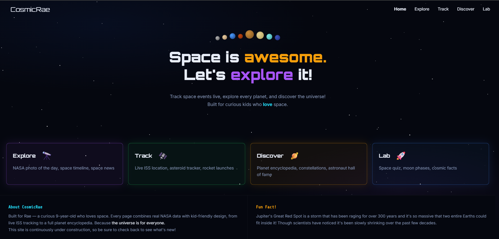
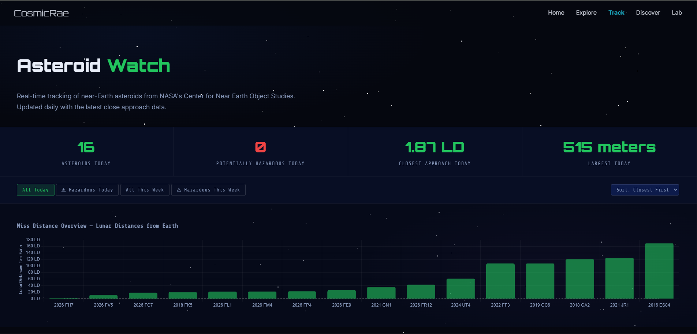
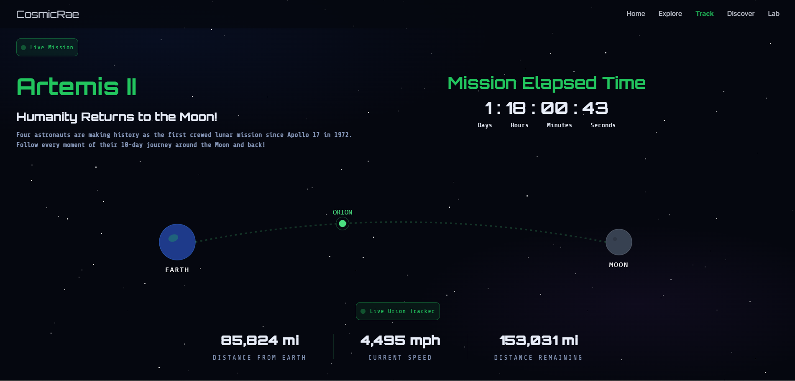

# CosmicRae

A kid-friendly space exploration website built for my 9-year-old niece, Rae, who loves space. Every page combines real NASA data with kid-friendly design, from live ISS and asteroid tracking to a full planet encyclopedia.

Because the universe is for everyone.

**Live Site:** [cosmicrae.space](https://cosmicrae.space)







---

## Features

- **Astronomy Picture of the Day** — NASA APOD API with historical date browsing
- **Live ISS Tracker** — Real-time International Space Station position using Leaflet.js and Open Notify API, with live crew data
- **Asteroid Watch** — NASA NeoWs API with Chart.js visualization, threat meter, filtering and sorting
- **Planet Encyclopedia** — All 8 planets with kid-friendly content, embedded NASA 3D explorer, and sticky navigation
- **Artemis II Tracker** — Live tracking of NASA's first crewed lunar mission since Apollo
- **ISS Encyclopedia** — History, stats, timeline, and science of the International Space Station
- **Constellation Background** — Real constellation data rendered on HTML5 Canvas with twinkling star animations

---

_This project is actively maintained and updated. New features added regularly._

---

## Tech Stack

- **Vanilla HTML, CSS, JavaScript**
- **NASA APIs** — APOD, NeoWs (Near Earth Object Web Service)
- **Open Notify API** — ISS real-time position and crew
- **Leaflet.js** — Interactive mapping for ISS tracker
- **Chart.js** — Data visualization for asteroid miss distances
- **HTML5 Canvas** — Custom constellation render with real star coordinates
- **CSS Animations** — Shooting stars, floating planets, twinkling stars, threat meters
- **SVG Animation** — Dynamic path tracking with `getPointAtLength()` for real-time spacecraft position
- **CCSDS OEM Ephemeris Data** — NASA/JSC trajectory data parsing and vector magnitude calculations
- **GitHub Pages** — Deployed via custom domain

---

## Data Sources & Notes

- **NASA APOD API** — Astronomy Picture of the Day
- **Open Notify API** — ISS real-time position and crew
- **NASA NeoWs API** — Near Earth Object data
- **NASA/JSC/FOD/FDO** — Artemis II OEM ephemeris file (CCSDS standard, EME2000 frame)

> Artemis II position data is based on NASA's pre-flight predicted trajectory, not live telemetry. Actual position may vary slightly due to in-flight burns and corrections. For real-time telemetry visit NASA's official AROW tracker.

---

## Pages

| Section  | Page                | What it demonstrates                                                                    |
| -------- | ------------------- | --------------------------------------------------------------------------------------- |
| Explore  | APOD                | NASA API integration, date picker, async/await                                          |
| Track    | ISS Tracker         | Real-time data, Leaflet.js, setInterval                                                 |
| Track    | Asteroid Watch      | Complex nested JSON, Chart.js, filtering/sorting                                        |
| Track    | Artemis II Tracker  | Ephemeris parsing, SVG path animation, vector magnitude math, real NASA trajectory data |
| Discover | Planet Encyclopedia | Dynamic JSON rendering, URL parameters, Canvas                                          |
| Discover | ISS Encyclopedia    | Static content design, timeline, stats layout                                           |

---

## Running Locally

```bash
git clone https://github.com/lexiturner7/CosmicRae.git
cd CosmicRae
open index.html
```

No build tools or dependencies required — open `index.html` directly in any browser.

---

## Why I Built This

I'm a junior software engineering student with a passion for aerospace and space exploration. I built CosmicRae for my niece Rae, who loves space and inspired me to make something that makes the universe feel exciting and accessible to kids. Every technical decision, from vanilla JavaScript over frameworks, to real NASA API integrations, was made intentionally to build strong fundamentals while creating something genuinely useful.

---

## Author

Lexi Turner

Built with ❤️ for Rae

[GitHub](https://github.com/lexiturner7) · [cosmicrae.space](https://cosmicrae.space)

---

_Data sources: NASA Open APIs, Open Notify, SpaceDevs Launch Library_
